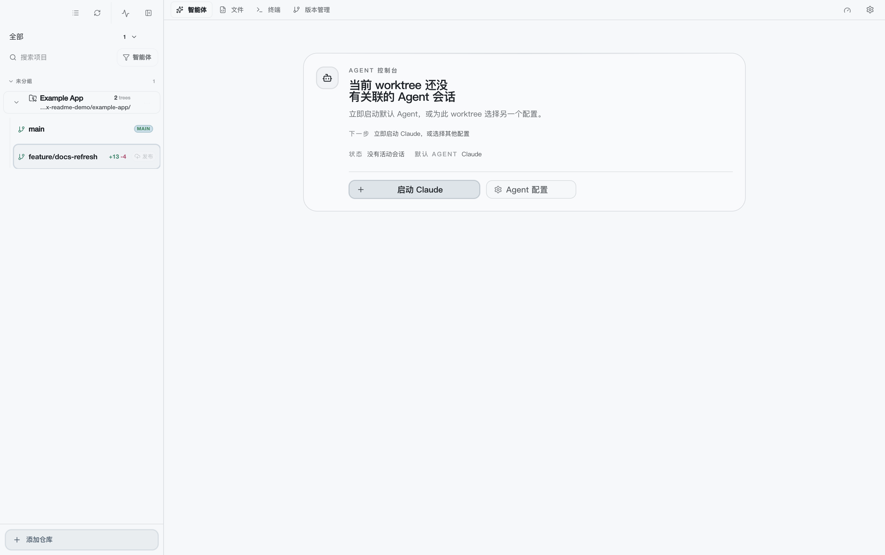
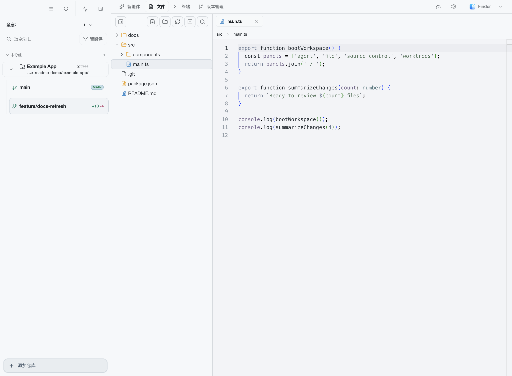
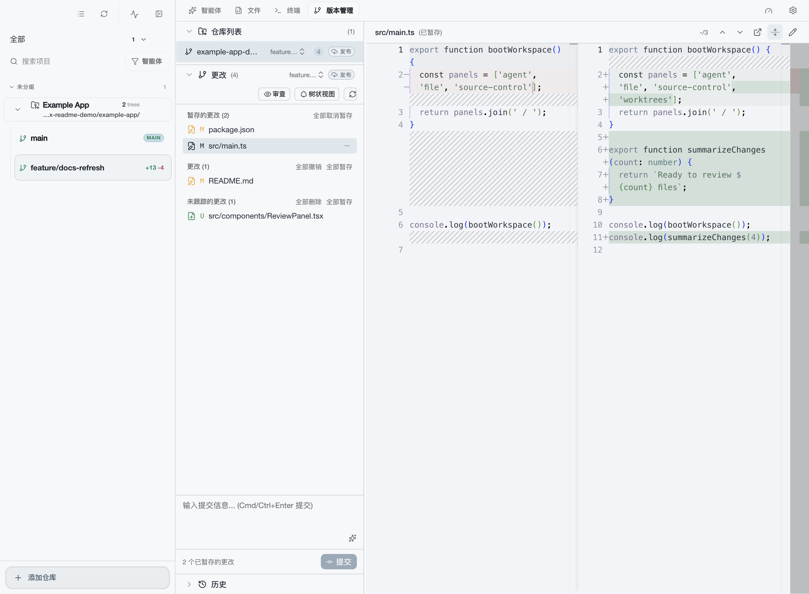
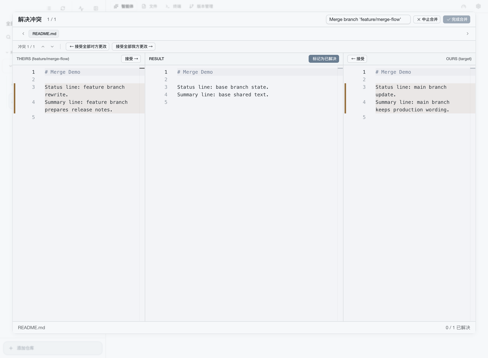

<p align="center">
  <picture>
    <source srcset="src/renderer/assets/logo.svg" type="image/svg+xml" />
    
  </picture>
</p>

<h1 align="center">Infilux</h1>

<p align="center">
  <strong>Multiple Agents, Parallel Flow</strong>
</p>
<p align="center">
  Unleash parallel intelligence within a single project.<br/>
  Let Claude, Gemini, and Codex weave through different worktrees simultaneously without context switching.
</p>

<p align="center">
  <a href="README.zh.md">中文</a> | <a href="README.md">English</a>
</p>

<p align="center">
  <a href="https://github.com/funenc-lab/infilux/releases/latest"></a>
  
  
  
  
</p>

<p align="center">
  <a href="https://t.me/EnsoAI_news"></a>
  <a href="https://t.me/EnsoAi_Offical"></a>
</p>

<p align="center">
  <a href="https://www.producthunt.com/products/ensoai?utm_source=badge-featured&utm_medium=badge&utm_campaign=badge-ensoai" target="_blank"></a>
</p>

---

## Workflow, Reimagined.

Stop stashing and popping. Infilux treats every branch as a first-class workspace with its own dedicated AI context.



---

## Example Project Used In These Screenshots

The screenshots below were captured from the current app build with a temporary demo repository named `Example App`.
This keeps the documentation grounded in a real worktree state instead of a static mock.

- Repository: `Example App`
- Worktrees: `main`, `feature/docs-refresh`
- Staged changes: `package.json`, `src/main.ts`
- Unstaged changes: `README.md`
- Untracked changes: `src/components/ReviewPanel.tsx`

Merge conflict screenshots use a second temporary repository named `Merge Demo` so the built-in merge editor shows a real conflict state.

```text
Example App
├── README.md
├── package.json
├── docs/
│   └── workflow-notes.md
└── src/
    ├── main.ts
    └── components/
        ├── ReviewPanel.tsx
        └── WorktreeStatus.tsx
```

---

## Project Origin

Infilux is a continued, secondary development of the project that was previously presented as
**EnsoAI**.

The current app is built on the earlier EnsoAI codebase and product direction, then continues
under the Infilux name with updated repository ownership, runtime identity, documentation, and
release infrastructure. It is not a from-scratch rewrite. The current canonical project locations
are:

- **Repository (SSH)**: `git@github.com:funenc-lab/infilux.git`
- **Repository (HTTPS)**: `https://github.com/funenc-lab/infilux`
- **Releases**: `https://github.com/funenc-lab/infilux/releases/latest`

### What changed

- The active product name is now **Infilux**
- The main GitHub repository has moved to `funenc-lab/infilux`
- New architecture and product documentation now use the Infilux name consistently
- Ongoing development, packaging, and support now happen under the Infilux identity

### What may still look old

During the migration window, some external surfaces may still use legacy `EnsoAI` or `ensoai`
identifiers, for example:

- package manager channels
- community links
- badges or third-party listings
- older screenshots, blog posts, issue discussions, or release references

### Continuity

- the codebase continues from the same project lineage
- the current implementation is based on the earlier EnsoAI codebase and has continued from there
- release history and historical references are still relevant
- existing users of the earlier EnsoAI-branded project are in the right place

When there is a naming mismatch, treat **Infilux** as the current official name and
`EnsoAI` / `ensoai` as legacy identifiers retained for compatibility or migration convenience.

---

## Installation

### Install Options

> Infilux is the active product name. GitHub Releases is the canonical and currently documented distribution source.

### Recommended Download

Download the installer for your platform from [GitHub Releases](https://github.com/funenc-lab/infilux/releases/latest):

| Platform | File |
|----------|------|
| macOS (Apple Silicon) | `Infilux-x.x.x-arm64.dmg` |
| macOS (Intel) | `Infilux-x.x.x.dmg` |
| Windows (Installer) | `Infilux Setup x.x.x.exe` |
| Windows (Portable) | `Infilux-x.x.x-portable.exe` |
| Linux (AppImage) | `Infilux-x.x.x.AppImage` |
| Linux (deb) | `infilux_x.x.x_amd64.deb` |

For release automation details, quality gates, and the local repair path, see [`docs/release-process.md`](docs/release-process.md).

### Package Manager Status

Homebrew, Scoop, and Winget are not documented as supported installation paths for the current Infilux releases.
Do not rely on legacy `ensoai` or `J3n5en.EnsoAI` package-manager identifiers unless a maintainer explicitly announces that a channel has been revalidated for a specific release.

### Build from Source

```bash
# Clone the repository
git clone git@github.com:funenc-lab/infilux.git Infilux
cd Infilux

# Install dependencies (requires Node.js 20+, pnpm 10+)
pnpm install

# Run in development mode
pnpm dev

# Build for production
pnpm build:mac    # macOS
pnpm build:win    # Windows
pnpm build:linux  # Linux
```

---

## Features

### Worktree-Scoped Agent Sessions

Each worktree keeps its own agent entry point, launch action, and session context.
You can stay on the branch you are working on, then start Claude, Codex, Gemini, or a custom CLI agent from the same surface.

Built-in support:
- **Claude** - Anthropic's AI assistant with persistent session workflows
- **Codex** - OpenAI's coding assistant
- **Gemini** - Google's AI assistant
- **Cursor** - Cursor's AI agent (`cursor-agent`)
- **Droid** - Factory CLI for AI-powered CI/CD
- **Auggie** - Augment Code's AI assistant
- **OpenCode** - OpenCode AI coding agent

You can also add custom agents by specifying the CLI command.

---

### Skill And MCP Policy Controls

Infilux can discover and control the skills, commands, subagents, and MCP servers that are projected into supported agent sessions.

- Browse discovered Claude capabilities, shared MCP servers, and personal MCP servers from a dedicated settings surface
- Set a global baseline, repository policy, and worktree-specific override for Skill and MCP access
- Open per-session launch options for supported agents before creating a new session
- See stale-policy notices when running sessions need to be restarted to pick up changed Skill or MCP settings

---

### Agent Session Canvas And Subagents

The agent panel supports both focused session work and multi-session monitoring.

- Keep multiple sessions for the same worktree available in tabs or a tiled canvas view
- Inspect session-scoped Codex subagents without leaving the active agent panel
- Route notification-driven sessions back into the chat canvas instead of losing the current workspace context
- Keep session-backed chat panels mounted so returning to an idle worktree is fast and predictable

---

### Integrated File Editor

The built-in Monaco editor is designed for quick worktree-local edits without leaving the app.



- File tree and editor stay scoped to the active worktree
- Monaco handles code editing for quick fixes and review follow-ups
- Open files remain attached to their worktree context across tab switches

---

### Source Control That Matches The Worktree

The source control panel shows staged, unstaged, and untracked files for the currently selected worktree, then opens a focused diff next to the list.



- Staged, unstaged, and untracked changes are separated clearly
- File selection opens a side-by-side diff for the active worktree
- Commit input, refresh, and review actions stay in the same workspace surface

---

### Review And Merge Flows

Infilux keeps review and merge operations close to the worktree they belong to.



- Start diff review from source control and continue the conversation in the agent panel
- Resolve merge conflicts with the built-in three-way merge editor
- Finish merge cleanup without dropping back to an external toolchain for routine work

---

### Git Worktree Management

Create, switch, and manage Git worktrees instantly without re-opening the project in another window.

- Create worktrees from existing or new branches
- Switch between worktrees with separate editor and agent context
- Delete worktrees with optional branch cleanup
- Track branch status directly from the sidebar

---

### IDE Bridge And Daily Quality-Of-Life

Use Infilux for orchestration, then jump into VS Code, Cursor, Ghostty, or other tools with a single click.

- Command palette access for panel control and workspace actions
- Multi-window support for parallel repository work
- Startup diagnostics for agent sessions and clearer failure states when runtime resources are exhausted
- Deferred file panels show a recoverable error state instead of leaving the workspace blank when loading fails
- Theme sync with terminal themes
- Keyboard shortcuts for tab switching and workspace navigation
- Settings persistence for recovery and repeatability

---

## Tech Stack

- **Framework**: Electron + React 19 + TypeScript
- **Styling**: Tailwind CSS 4
- **Editor**: Monaco Editor
- **Terminal**: xterm.js + node-pty
- **Git**: simple-git
- **Database**: sqlite3

---

## Architecture at a Glance

Infilux is organized around four explicit layers:

```text
Renderer UI
  -> window.electronAPI (preload bridge)
    -> IPC channels / push events
      -> Main-process handlers
        -> Native services / child processes / filesystem / remote runtime
```

Key architectural ideas:

- **Worktree-first isolation**: editor tabs, terminals, and agent sessions are scoped to worktrees
- **Explicit process boundaries**: renderer does not directly consume Electron or Node primitives
- **Keep-mounted panels**: file, terminal, and source-control panels preserve runtime state when hidden
- **Local + remote support**: file and navigation flows are designed for both local paths and remote virtual paths

Project layers:

- `src/main/` — lifecycle, IPC handlers, native/system services, cleanup
- `src/preload/` — typed `window.electronAPI` bridge
- `src/renderer/` — React UI, Zustand stores, React Query hooks, Monaco and xterm integration
- `src/shared/` — cross-process contracts and pure utilities

Architecture docs:

- `docs/architecture.md` — system-level architecture, boundaries, hotspots, and extension paths
- `docs/editor-architecture.md` — editor, file tree, navigation, dirty-state, and external-change flows
- `docs/remote-architecture.md` — remote repository model, remote runtime, virtual-path semantics, auth, and lifecycle

---

## FAQ

### Basic Usage

<details>
<summary><strong>How is Infilux different from a regular IDE?</strong></summary>

Infilux focuses on **Git Worktree + AI Agent** collaboration. It's not meant to replace VS Code or Cursor, but rather serves as a lightweight workspace manager that allows you to:
- Quickly switch between multiple worktrees, each running an independent AI Agent
- Develop multiple feature branches simultaneously without interference
- Jump to your preferred IDE anytime via "Open In" for deeper development

</details>

<details>
<summary><strong>Which AI Agents are supported?</strong></summary>

Built-in support for Claude, Codex, Gemini, Cursor Agent, Droid, and Auggie. You can also add any CLI-based agent in settings by specifying the launch command.

</details>

<details>
<summary><strong>Are Agent sessions preserved?</strong></summary>

Yes. Each worktree's Agent session is saved independently. When you switch back to a worktree, the previous conversation context is still there.

</details>

---

### Use Cases

<details>
<summary><strong>When should I use Infilux?</strong></summary>

| Scenario | Description |
|----------|-------------|
| **Parallel Development** | Work on feature-A and bugfix-B simultaneously, each branch has independent AI sessions and terminals |
| **AI-Assisted Code Review** | Let AI review code in a new worktree without affecting main branch development |
| **Experimental Development** | Create a temporary worktree for AI to experiment freely, delete if unsatisfied |
| **Comparison Debugging** | Open multiple worktrees side by side to compare different implementations |

</details>

<details>
<summary><strong>Why use official CLIs instead of ACP?</strong></summary>

While ACP can unify core capabilities across different Agents, it's limited to just those core features and lacks many functionalities. Switching between different Agents isn't a common scenario, and the core features of different Agent CLIs are quite similar. We believe that for experienced developers, the native CLIs are more productive.

</details>

<details>
<summary><strong>What project size is Infilux suitable for?</strong></summary>

Best suited for small to medium projects. For large monorepos, we recommend using it alongside VS Code or similar full-featured IDEs — Infilux handles worktree management and AI interaction, while the IDE handles deep development.

</details>

---

### Development Workflow

<details>
<summary><strong>What's a typical development workflow with Infilux?</strong></summary>

```
1. Open Workspace
   └── Select or add a Git repository

2. Create/Switch Worktree
   └── Create a worktree for new feature (auto-creates branch)

3. Start AI Agent
   └── Chat with Claude/Codex in the Agent panel
   └── AI works directly in the current worktree directory

4. Edit & Test
   └── Quick edits with built-in editor
   └── Run tests/builds in terminal

5. Commit & Merge
   └── Git commit/push in terminal
   └── Or use "Open In" to jump to IDE for final review
```

</details>

<details>
<summary><strong>How to efficiently manage multiple parallel tasks?</strong></summary>

1. Create a separate worktree for each task (`Cmd+N` or click + button)
2. Use `Cmd+1-9` to quickly switch between worktrees
3. Each worktree has independent Agent sessions, terminal tabs, and editor state
4. Delete worktree when done, optionally delete the branch too

</details>

<details>
<summary><strong>How to review AI-generated code?</strong></summary>

Recommended workflow:
1. Let AI generate code in a separate worktree
2. Review using built-in editor or "Open In Cursor/VS Code"
3. Commit in terminal if satisfied; continue the conversation or delete the worktree if not

</details>

---

### Keyboard Shortcuts

<details>
<summary><strong>What are the common keyboard shortcuts?</strong></summary>

| Shortcut | Function |
|----------|----------|
| `Cmd+Shift+P` | Open command palette |
| `Cmd+,` | Open settings |
| `Cmd+1-9` | Switch to corresponding tab |
| `Cmd+T` | New terminal/Agent session |
| `Cmd+W` | Close current terminal/session |
| `Cmd+S` | Save file |
| `Shift+Enter` | Insert newline in terminal |

</details>

---

### Troubleshooting

<details>
<summary><strong>Agent won't start?</strong></summary>

1. Verify the CLI tool is installed (e.g., `claude`, `codex`)
2. Manually run the command in terminal to verify
3. Check Agent path configuration in settings

</details>

<details>
<summary><strong>Terminal display issues/artifacts?</strong></summary>

Go to Settings → Terminal → Switch renderer from WebGL to DOM.

</details>

---

## License

MIT License - see [LICENSE](LICENSE) for details.
